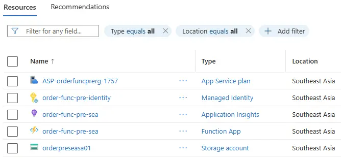

Automates the local-to-cloud creation and deployment of a Flex Consumption Python HTTP Function. This code snippet is based on the step-by-step [Minimalistic Azure Function App creation](../../posts/2026-05-29-http-azure-function-setup/index.qmd) post.

Opting for PowerShell automation has limitations and does not match a robust production-grade Infrastructure as Code (IaC) approach (Bicep/Terraform with a GitHub repo and CI/CD pipelines). The goal is a productivity boost to create and deploy basic Function Apps quickly, not a replacement for a full-fledged IaC setup.

# Local tools installation

Install these tools on the local system before running the script.

- [Azure Functions Core Tools](https://learn.microsoft.com/en-us/azure/azure-functions/functions-run-local?tabs=windows%2Cisolated-process%2Cnode-v4%2Cpython-v2%2Chttp-trigger%2Ccontainer-apps&pivots=programming-language-python)
- [Azure CLI](https://learn.microsoft.com/en-us/cli/azure/install-azure-cli-windows?view=azure-cli-latest&pivots=winget)
- [Node.js](https://nodejs.org/en/download) to install Azurite
- [Azurite](https://learn.microsoft.com/en-us/azure/storage/common/storage-install-azurite?toc=%2Fazure%2Fstorage%2Fblobs%2Ftoc.json&bc=%2Fazure%2Fstorage%2Fblobs%2Fbreadcrumb%2Ftoc.json&tabs=visual-studio%2Cblob-storage)
- [pyenv-win](https://github.com/pyenv-win/pyenv-win)

# Manual actions before running the script

Complete these steps on Azure and locally. The script assumes they are already done.

::: {.snippet-steps}
1. [Create an Azure account](https://portal.azure.com/) if you do not have one.

2. Create or choose a **subscription** in the Azure portal.

3. Log in using `az login` and when prompted, pick the subscription you intend to bill against.

4. Find an Azure region that supports Flex Consumption Function Apps. Check how to on [functions-flex-supported-regions-cli](https://github.com/MicrosoftDocs/azure-docs/blob/main/includes/functions-flex-supported-regions-cli.md).
:::

# Generating standardised script parameters

The parameters of the script to create and deploy the Function App in Azure are as follows.

::: {.small}

| Parameter | Local/Cloud | Purpose | Naming Pattern |  Examples |
|---|---|---|---|---|
| `$ProjectRootDir` | Local | full path to the project directory (created by the script) | `C:\\...\\\{product}_func` | order_func, order_func |
| `$FunctionProjectDir` | Local | directory name for the Function App project inside `$ProjectRootDir` | `{product}_function_{env}` | order_function_pre, order_function_dev |
| `$Location` | Cloud | Azure region | Azure region name | `southeastasia` |
| `$ResourceGroupName` | Cloud | Resource group for the Function App | `{product}-func-{env}-rg` | `order-func-dev-rg`, `order-func-pre-rg` |
| `$StorageAccountName` | Cloud | Storage account (globally unique) | `{product}{env}{region}sa{instance}` | `orderdevseasa01`, `orderprewesa01` |
| `$ManagedIdentityName` | Cloud | User-assigned managed identity for storage access | `{product}-func-{env}-identity` | `order-func-dev-identity`, `order-func-pre-identity` |
| `$FunctionAppName` | Cloud | Function App name (globally unique) | `{product}-func-{env}-{region}` | `order-func-dev-sea`, `order-func-pre-we` |
| `$PythonVersion` | Cloud | Azure Functions runtime version | Python major.minor version | `3.11`, `3.12` |
| `$PyVer` | Local | pyenv Python version for local .venv (must match `$PythonVersion`) | Python major.minor.patch version | `3.11.10`, `3.12.3` |
| `$FunctionName` | Both | HTTP trigger function name (Python identifier) | `{product}_http_{env}` | `order_http_dev`, `order_http_pre` |
| `$HttpsOnly` | Cloud | Enforce HTTPS only on the Function App | `true` or `false` | `true` |
| `$InstanceMemory` | Cloud | Flex Consumption instance memory (MB) | `512`, `1024`, or `2048` | `512` |
| `$Tags` | Cloud | Azure resource tags (space-separated `tagName=value`; omit for none) | user-defined (case preserved) | `Environment=Production Owner=Team` |
| `$DeactivateApplicationInsights` | Cloud | Remove Application Insights connection settings | `true` or `false` | `false` |
:::

A helper script is provided below to generate a list of *standardised* parameters that proves useful when creating Function Apps for different products and environments. It requires this 2-step setup.

## Copy the region code map

Azure region name abbreviations should be used consistently across the Function App parameters. A maintained list of region codes can be found on the [Azure AVM regions list](https://github.com/Azure/terraform-azurerm-avm-utl-regions/blob/main/locals.geo.codes.tf.json). A copy is available at [locals.geo_codes.tf.json](locals.geo_codes.tf.json) in case of discontinued availability.

Save this JSON file locally.

## Copy PowerShell script

Save the PowerShell script [NewAzureFunctionDeployParams.ps1](NewAzureFunctionDeployParams.ps1) in the same directory as the region code map file.

**Checking files in the tooling directory:**

:::: {.code-output}
```powershell
dir -name C:\projects\tools\create_az_http_function_app
```

<pre class="output-pane">locals.geo_codes.tf.json
NewAzureFunctionDeployParams.ps1</pre>
::::


## Run the helper script

**Example:**

:::: {.code-output}
```powershell
.\NewAzureFunctionDeployParams.ps1 `
    --project-root-dir "C:\projects" `
    --product-name order `
    --env pre `
    --region-name southeastasia `
    --instance-nbr 01 `
    --python-version 3.13.10 `
    --https-only true `
    --instance-memory 512 `
    --tags "Environment=Demo Owner=DevTeam" `
    --deactivate-application-insights false
```

<pre class="output-pane">--ProjectRootDir "C:\projects\order_func" 
--FunctionProjectDir "order_function_pre" 
--Location "southeastasia" 
--ResourceGroupName "order-func-pre-rg" 
--StorageAccountName "orderpreseasa01" 
--ManagedIdentityName "order-func-pre-identity" 
--FunctionAppName "order-func-pre-sea" 
--PythonVersion "3.13" 
--PyVer "3.13.10" 
--FunctionName "order_http_pre"
--HttpsOnly "true"
--InstanceMemory "512"
--Tags "Environment=Demo Owner=DevTeam"
--DeactivateApplicationInsights "false"</pre>
::::


# Running the create and deploy script

The PowerShell script [CreateAndDeployAzureFunction.ps1](CreateAndDeployAzureFunction.ps1) creates a function project locally and deploys a Function App in Azure. Save the script locally, for example next to `NewAzureFunctionDeployParams.ps1`. Pass the standardised parameter values from the `NewAzureFunctionDeployParams.ps1` script output to the script.

**Example:**

:::: {.code-output}
```powershell
.\CreateAndDeployAzureFunction.ps1 `
    --ProjectRootDir "C:\projects\order_func" `
    --FunctionProjectDir "order_function_pre" `
    --Location "southeastasia" `
    --ResourceGroupName "order-func-pre-rg" `
    --StorageAccountName "orderpreseasa01" `
    --ManagedIdentityName "order-func-pre-identity" `
    --FunctionAppName "order-func-pre-sea" `
    --PythonVersion "3.13" `
    --PyVer "3.13.12" `
    --FunctionName "order_http_pre" `
    --HttpsOnly "true" `
    --InstanceMemory "512" `
    --Tags "Environment=Demo Owner=DevTeam" `
    --DeactivateApplicationInsights "false"
```

<pre class="output-pane">:: [Step] :: check Azure resource names are available
:: [Step] :: create project root
:: [Step] :: func init
...
:: [Step] :: pyenv install 3.13.10
...
:: [Step] :: pyenv local 3.13.10
:: [Step] :: create .venv
:: [Step] :: activate .venv
:: [Step] :: upgrade pip
...
:: [Step] :: install requirements.txt
...
:: [Step] :: create HTTP trigger function
...      
:: [Step] :: write .funcignore
:: [Step] :: create resource group
...
:: [Step] :: register Microsoft.Storage
:: [Step] :: create storage account
...
:: [Step] :: assign Storage Blob Data Owner role
...
:: [Step] :: register Microsoft.Web
:: [Step] :: create function app
...
:: [Step] :: configure Application Insights managed identity auth
...
:: [Step] :: configure AzureWebJobsStorage managed identity
...
:: [Step] :: remove AzureWebJobsStorage connection string
...
:: [Step] :: publish function app to Azure
...
The deployment was successful!
Functions in order-func-pre-sea:
    order_http_pre - [httpTrigger]
        Invoke url: https://order-func-pre-sea.azurewebsites.net/api/order_http_pre

success: local function created and deployed to Azure
Function App: https://order-func-pre-sea.azurewebsites.net
Project path: C:\projects\order_func\order_function_pre</pre>
::::

**Contents of Resource group `order-func-pre-rg` on Azure:**

{fig-align="left"}


## What if a resource already exists in Azure?

Before any local or Azure setup, the script checks whether Azure resources with the specified names already exist. If the resource group, storage account, managed identity, or function app already exists, the script aborts.

**Example of output with existing Azure resources:**

<pre class="output-pane">:: [Step] :: check Azure resource names are available
failure: Azure Function setup and deploy
Azure resource(s) already exist: resource group 'order-func-pre-rg'; storage account 'orderpreseasa01'; managed identity 'order-func-pre-identity' in resource group 'order-func-pre-rg'; function app 'order-func-pre-sea'. 
Aborting before local or Azure setup.</pre>

# Deployment sanity checks

Logs of the script `CreateAndDeployAzureFunction.ps1` already provide a summary of the Function App deployment success or failure. An additional easy manual sanity check is to check the Function App availability using `az functionapp function list`.

:::: {.code-output}
```powershell
$resourceGroupName = "order-func-pre-rg"
$functionAppName = "order-func-pre-sea"

az functionapp function list `
    --resource-group $resourceGroupName `
    --name $functionAppName | ConvertFrom-Json |
    Select-Object `
    @{Name="Name";Expression={$_.config.name}},
    @{Name="Route";Expression={($_.config.bindings | Where-Object type -eq "httpTrigger").route}},
    @{Name="InvokeUrlTemplate";Expression={$_.invokeUrlTemplate}} |
    Format-Table -AutoSize
```

<pre class="output-pane">Name           Route          InvokeUrlTemplate
----           -----          -----------------
order_http_pre order_http_pre https://order-func-pre-sea.azurewebsites.net/api/order_http_p…</pre>
::::
 